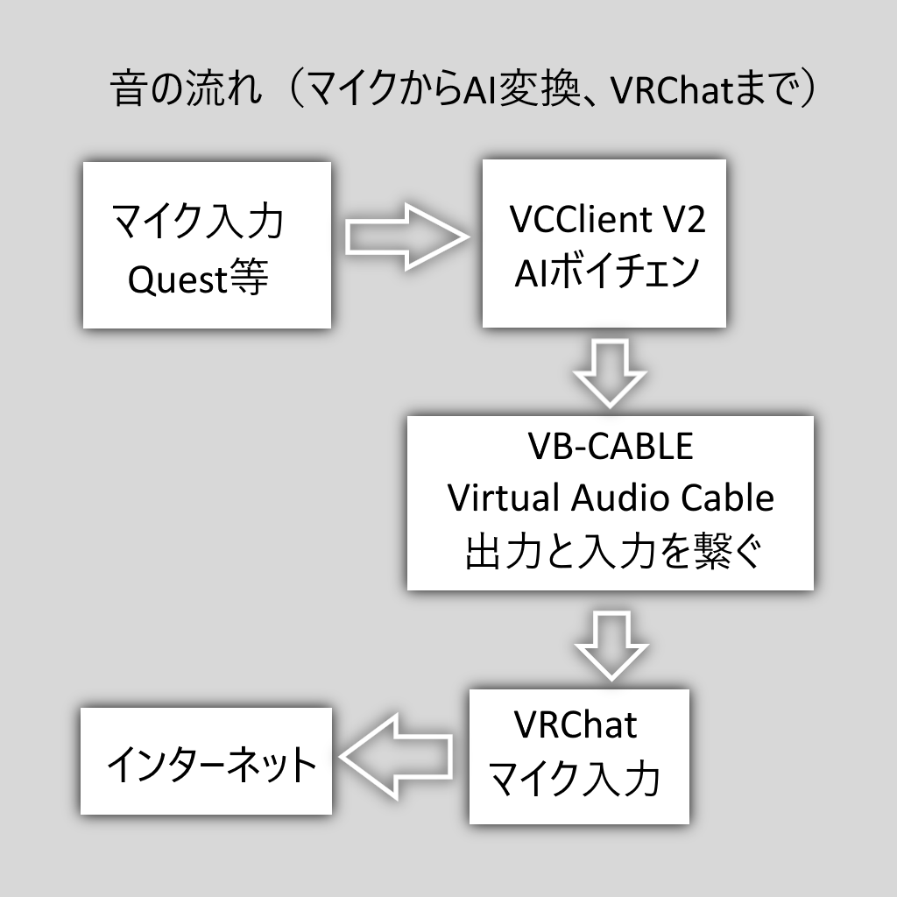

# VCClient 参考リンク集

以下は、AIボイチェン体験会場に掲示した各種リンクと補足情報のリストです。

---

YouTube 【AIボイチェン】VC Clientで女の子になろう！Ver2対応版リメイク【RVC】

https://www.youtube.com/watch?v=nCVoPz3BQXE

---

GitHub VCClient V2 リアルタイムボイスチェンジャー

https://github.com/w-okada/voice-changer/tree/v.2

うまく動かなかったら、V1を試してみてください。

---

VB-CABLE Virtual Audio Device

https://vb-audio.com/Cable/

より高度なエフェクトを掛けたい場合は、Voicemeeter や Banana も使えますが、VRChat でボイチェンを使うだけなら、Virtual Audio Cable で充分です。

---

BOOTH 電脳天使工業様 凛音エル ボイスモデル RVCv2 落ち着いたお姉さん風モデル 無料サンプル有り

https://booth.pm/ja/items/5475738

---

YouTube VRChat と VCClient の、AIボイチェン遅延時間の聞き比べ

https://www.youtube.com/watch?v=GGrnsCCDLhU

---

