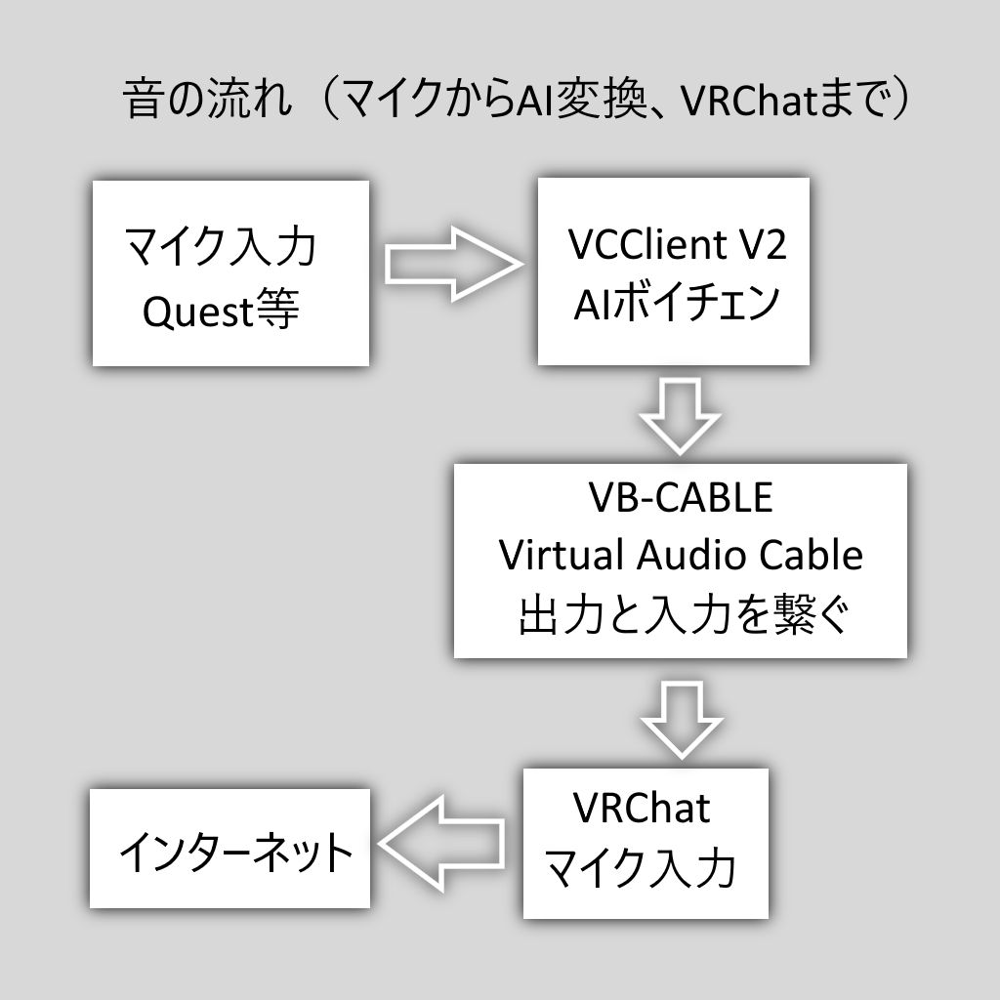

# VCClient 参考リンク集

以下は、AIボイチェン体験会場に掲示した各種リンクと補足情報のリストです。

---

YouTube 楓怜瑠那 / Karen Runa CH. [2024年8月最新版] この動画で全て解決! RVCボイスチェンジャーの導入から使い方まで詳しく解説!

https://www.youtube.com/watch?v=9cveuEJwCmE

---

GitHub VCClient V2 リアルタイムボイスチェンジャー

https://github.com/w-okada/voice-changer/tree/v.2

うまく動かなかったら、V1を試してみてください。

---

VB-CABLE Virtual Audio Device

https://vb-audio.com/Cable/

より高度なエフェクトを掛けたい場合は、Voicemeeter や Banana も使えますが、VRChat でボイチェンを使うだけなら、Virtual Audio Cable で充分です。

---

BOOTH 電脳天使工業様 凛音エル ボイスモデル RVCv2 落ち着いたお姉さん風モデル 無料サンプル有り

https://booth.pm/ja/items/5475738

---

YouTube VRChat と VCClient の、AIボイチェン遅延時間の聞き比べ

https://www.youtube.com/watch?v=GGrnsCCDLhU

---

||VSTプラグイン|バ美声|VCClient (RVCv2)|VCClient (Beatrice_v2)|SuperToneShift|
|---|---|---|---|---|---|
|技術|ピッチフォルマント変換|ピッチフォルマント変換|Retrieval-based AI変換エンジン|軽量・低遅延AI変換エンジン|独自AIエンジン|
|ボイトレ|地声練習必須|地声練習必須|地声でもそれなり|地声でもそれなり|地声でもそれなり|地声でもそれなり|
|遅延|ほとんど無し|ほとんど無し|0.5秒～1秒程度|0.1秒程度|0.1秒程度？|
|ハードウェア|CPUなど|CPU|GPU|CPU|CPU|
|本体価格|無料/有料など色々|有料 (体験版あり)|無料|無料|有料 (体験版あり)|
|インストール|VST環境の構築が面倒|仮想オーディオのインストールが面倒|仮想オーディオのインストールが面倒|仮想オーディオのインストールが面倒|とっても簡単|
